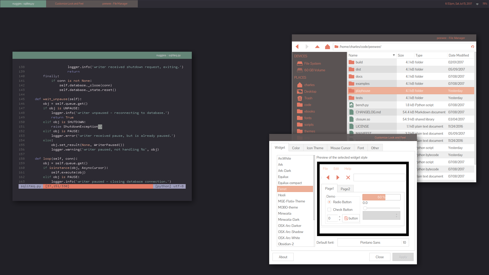
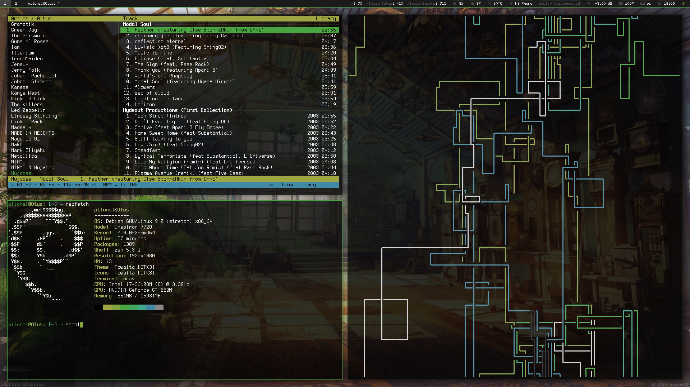

# unixporn [colorcontest] results

so the month of July was [color scheme month](https://redd.it/6feh1l) on [unixporn](https://reddit.com/r/unixporn). we got a lot of great entries, so thanx to everone who submitted. i'm happy to report the __winner__ of the contest is **[tudurom](https://tudorr.xyz/)**! here's a little gallery of all the entires. along with post title and author are a __source__ link which leads to the initial reddit post. most contain more details about the setup. and a __colors__ link contains a local copy of the submitted color schemes for archival purposes.

------------------------------------

H̆̋̏̏͒ͤͪ ͂͐͂̇̈́È ͒́͡X̢ͨ͌ by [tudurom](https://www.reddit.com/user/tudurom) // [source](https://redd.it/6lokhi) :: [colors](colors/hex)

Astrodusk by [lovelybac0n](https://www.reddit.com/user/lovelybac0n) // [source](https://redd.it/6p7dbf) :: [colors](colors/astrodust)

Become nOne by [NerdyPepper](https://www.reddit.com/user/NerdyPepper) // [source](https://redd.it/6q9kqv) :: [colors](colors/n0ne)

Minimalistic ZX Spectrum color theme for iTerm by [superEpicRedditBoy](https://www.reddit.com/user/superEpicRedditBoy) // [source](https://redd.it/6llh4g) :: [colors](colors/zxspectrum)

hyper light drifter by [novcn](https://www.reddit.com/user/novcn) // [source](https://redd.it/6p43fi) :: colors [1](colors/hyperlight_cave) [2](colors/hyperlight_camp) [3](colors/hyperlight_tunnel)

Palendrome by [Nanjue](https://www.reddit.com/user/Nanjue) // [source](https://redd.it/6qnsxv) :: [colors](colors/palendrome)

dusty by [coleifer](https://www.reddit.com/user/coleifer) // [source](https://redd.it/6nj6z5) :: [colors](colors/dusty)

Beta by [zezic](https://www.reddit.com/user/zezic) // [source](https://redd.it/6nm1c8) :: [colors](colors/beta)

Hyperbeast by [NILCLMS](https://www.reddit.com/user/NILCLMS) // [source](https://redd.it/6ozsw4) :: [colors](colors/hyperbeast)

Colorspectrum by [julesklord](https://www.reddit.com/user/julesklord) // [source](https://redd.it/6orrhr) :: [colors](colors/colorspectrum)

nikes by [mihir94](https://www.reddit.com/user/mihir94) // [source](https://redd.it/6qgcv7) :: [colors](colors/nikes)

vapor by  [__geb](https://www.reddit.com/user/__geb) // [source](https://redd.it/6lgjjm) :: [colors](colors/vapor)

I ❤ Googles Material Design by [Ben_Kerry](https://www.reddit.com/user/Ben_Kerry) // [source](https://redd.it/6m06kq) :: [colors](colors/material)

purple haze by [a-109-107](https://www.reddit.com/user/a-109-107) // [source](https://redd.it/6nlgul) :: [colors](colors/purple_haze)

Dazzle by [piecesofquiet777](https://www.reddit.com/user/piecesofquiet777) // [source](https://redd.it/6qm5xp) :: [colors](colors/dazzle)

mugatu! by [coleifer](https://www.reddit.com/user/coleifer) // [source](https://redd.it/6qsn5s) :: [colors](colors/mugata)

opencucks by [coleifer](https://www.reddit.com/user/coleifer) // [source](https://redd.it/6lth67) :: [colors](colors/opencucks)

Bluish theme for i3 (eye friendly) by [Tigrezno](https://www.reddit.com/user/Tigrezno) // [source](https://redd.it/6ksig7) :: [colors](colors/blueish)

butterfly by [MrHudson2212](https://www.reddit.com/user/MrHudson2212) // [source](https://redd.it/6nmpur) :: [colors](colors/butterfly)

The watchmaker by [_Pilonsi](https://www.reddit.com/user/_Pilonsi) // [source](https://redd.it/6ldmmg) :: [colors](colors/the_watchmaker)

Am I still in time for the contest? by [felixphew](https://www.reddit.com/user/felixphew) // [source](https://redd.it/6qgr72) :: [colors](colors/felixphew)

perfect fit by [Alternate_Data](https://www.reddit.com/user/Alternate_Data) // [source](https://redd.it/6pp31l) :: [colors](colors/perfect_fit)

dwm on debian by [balkenbrij](https://www.reddit.com/user/balkenbrij) // [source](https://redd.it/6qqf94) :: [colors](colors/balkenbrij)

blaque magick (posthumous entry) by [x_ero](https://www.reddit.com/user/x_ero) // [source](https://redd.it/6qqf94) :: [https://redd.it/6r6gxn](colors/blaquemagick)

